---
mathjax:
  presets: '\def\lr#1#2#3{\left#1#2\right#3}'
---

# Zeven Segment Display

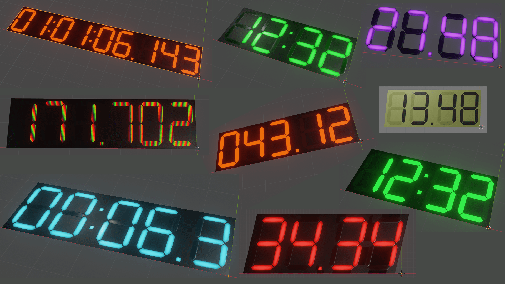

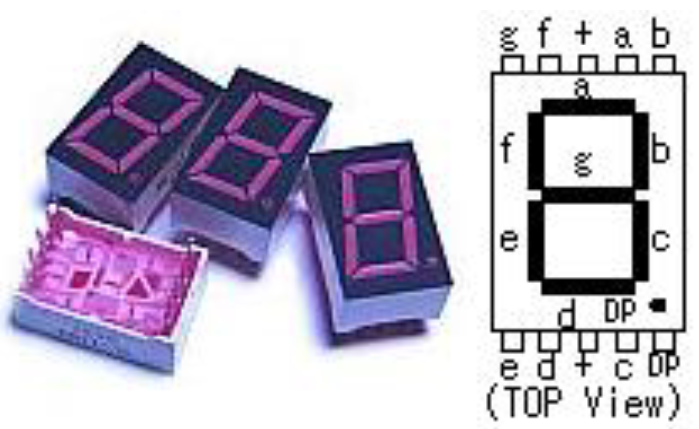

Een 7-segmentdisplay zijn 7 of meer rechthoekige leds die kunnen gebruikt worden om cijfers en alfanumerieke tekens op een scherm te vormen zoals in de figuur, zoals bijvoorbeeld het beeldscherm van een klokradio.

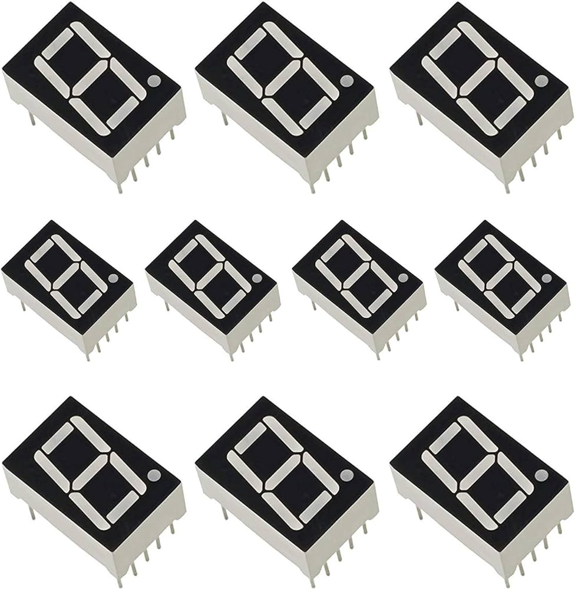

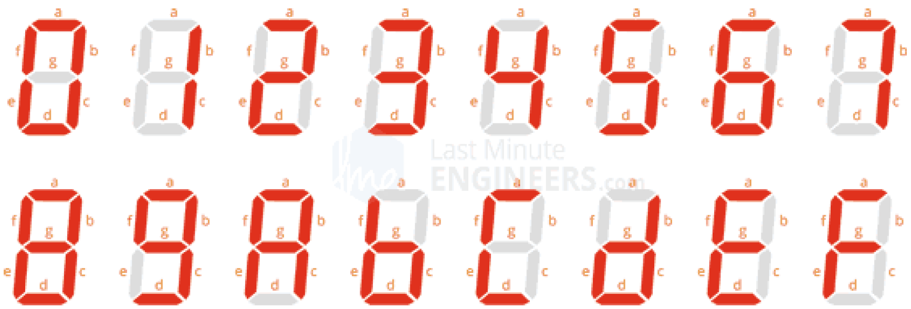

> #### Er bestaan twee types 7-segmentdisplays die voorgesteld zijn in de volgende figuur, namelijk:!
>
> - Die met gemeenschappelijke anode (Common Anode CA).
> - Die met gemeenschappelijke kathode (Common Cathode CC).
>
>  Door het *type-nummer* van het betreffende device op te zoeken kan je weten over welk type het gaat.

Bij een display van het CA-type zijn alle anodes van de 8 leds met elkaar en met de + van de voeding verbonden. Als er op één van de kathodes van de leds een lage spanning (ongeveer 0V of een logische 0) staat, dan zal deze LED oplichten.

Bij een display van het CC-type zijn de kathodes van de 8 leds met elkaar verbonden en aangesloten op de massa van de voeding. Als er op het display een LED moet oplichten, dan moet er op zijn anode een positieve spanning aangesloten worden (meestal de voedingsspanning of een logisch 1).

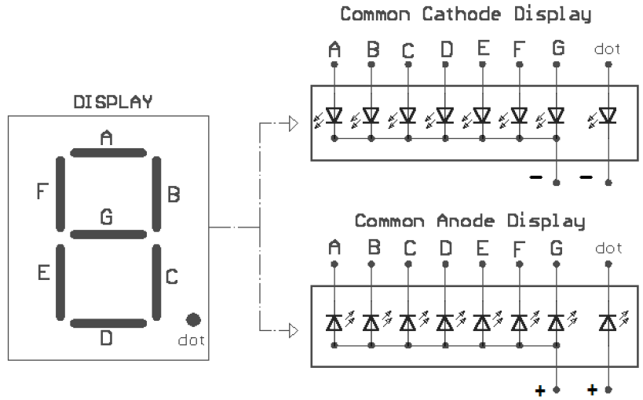

Op deze displays kunnen verschillende tekens zichtbaar gemaakt worden door de gepaste leds te laten oplichten.

In de volgende tabel staat de code om het getal 0 op een 7-segmentsdisplay van het CC-type te vormen. Kunnen jullie de andere codes in de tabel aanvullen?

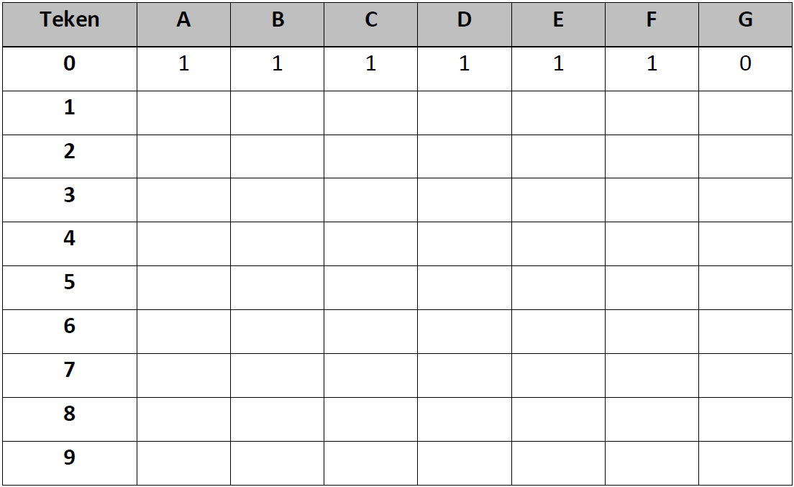

# SC56-11EWA

In deze bundel gaan we de 7-segment display met referentie SC56-11EWA (KingBright) gebruiken. Hoe de display er uit ziet is weergegeven in de volgende figuur.

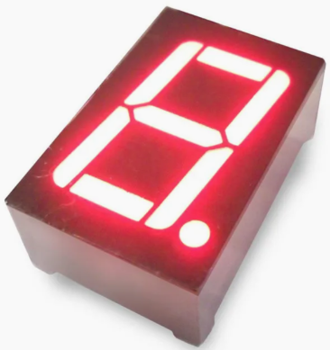
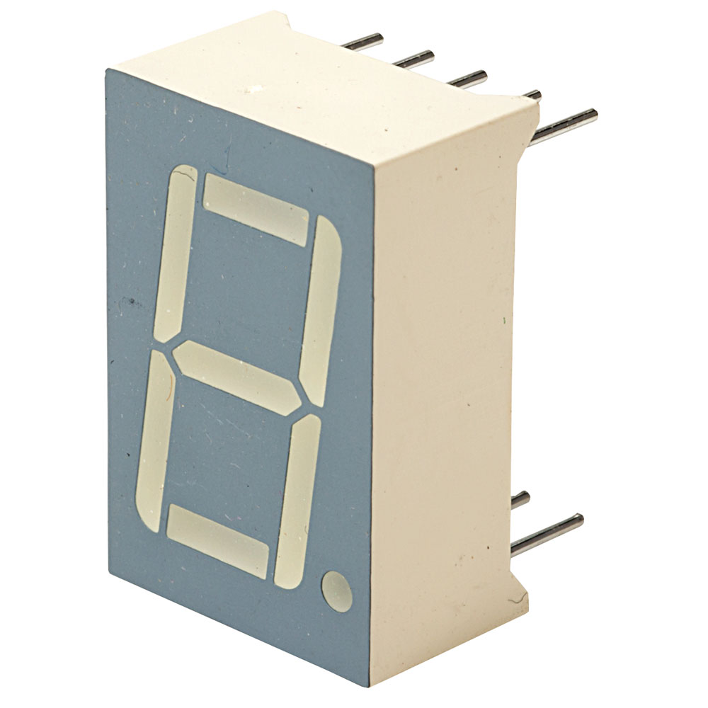

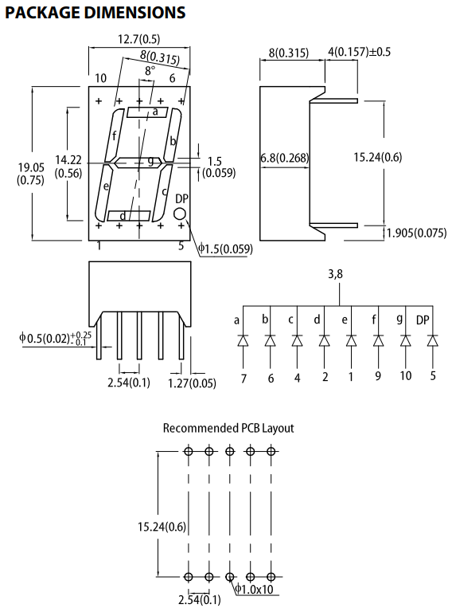

De pinnummering begint bij de meeste IC’s (=Integrated Circuits) links boven. Bekijk dit component in vorige figuur heel goed en herken de pinnummering. In het schema met LED-dioden kan worden nagegaan welk LED-segment de pinnummering overeenkomt.

We weten dat een 7-segment display bestaat uit 7 langwerpige leds die de 7 segmenten vormen. Bij dit display is er nog 1 segment of leds die gebruikt kunnen worden als punt of komma (DP = decimale punt).

Wij willen de 7-segment display aansturen met de ESP32 feather van Adafruit. We weten dat we de uitgangen van de microcontroller hoog kunnen maken waarbij de spanning gelijk wordt aan 3,3V. Als we een led-segment willen doen oplichten van de SC56-11EWA dan moeten we aan de anode van de led een spanning leggen van 2V en dan verbruikt het segment een stroom van 10mA. Deze waarde haal je uit de datasheet van het display. Zie volgende figuur. Bij andere 7-segment displays kunnen dit andere waarden zijn en zoek je die best op in de datasheet.

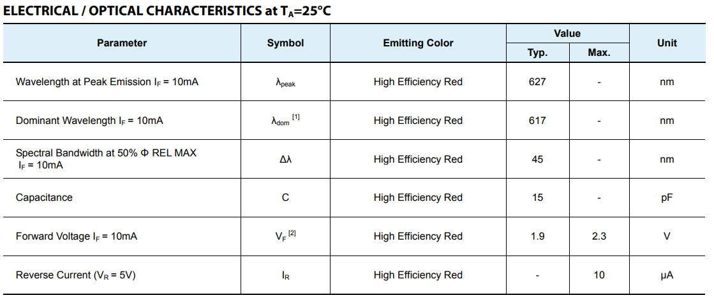

Als deze spanning gelijk is aan 2V dan vloeit er een stroom van 20mA (2). De uitgangen van ESP32 feather van Adafruit kunnen gerust deze stroom leveren zonder beschadiging op te lopen. Natuurlijk is de spanning van de uitgangen van de microcontroller veel te hoog (=3,3V).
Om ervoor te zorgen dat de spanning maar 2V op de pin van een led-segment zal zijn moet er gebruik gemaakt worden van een voorschakelweerstand. Het schema om het led-segment A van de microcontroller aan te sturen is weergegeven in de volgende figuur. Wat nog ontbreekt is de waarde van de
voorschakelweerstand R1.

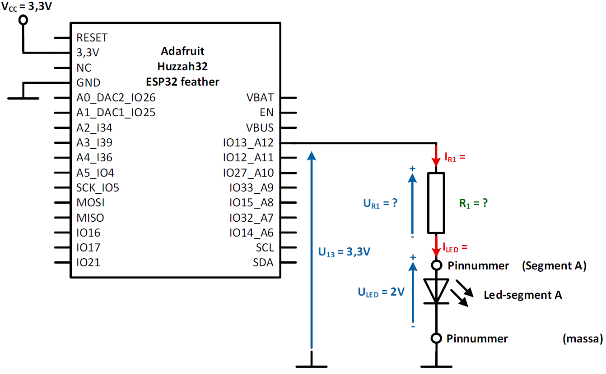

Opdracht: Bereken de waarde van weerstand R1. Kies dan een weerstand uit de E12-reeks die je praktisch gaatgebruiken.

