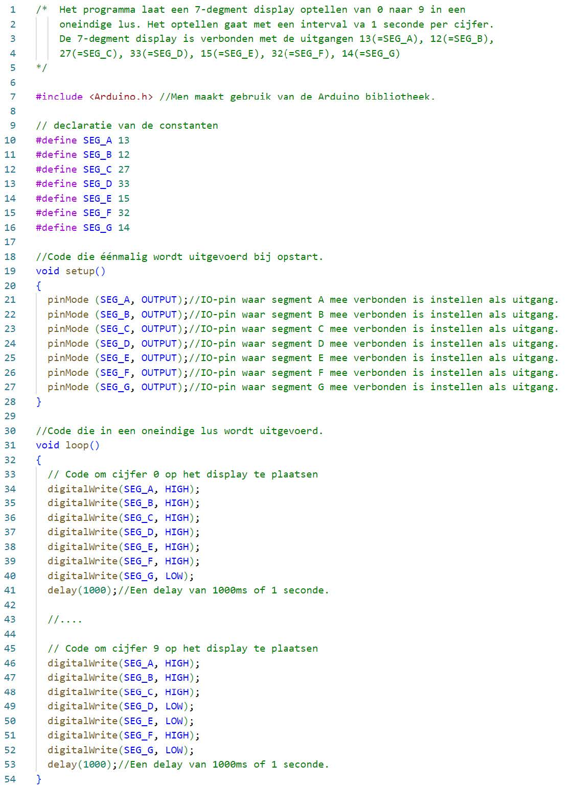

# Software

Een deel van het programma om de 7-segment display op te laten tellen is afgebeeld in de volgende figuur. Enkel het eerste cijfer 0 en het laatste cijfer 9 staat in het programma. De cijfers 1, 2, 3, 4, 5, 6, 7 en 8 moeten jullie zelf nog aanvullen.

# Opdracht

