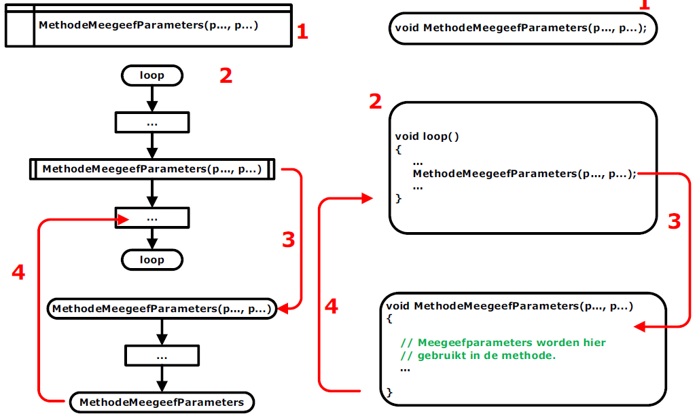

---
mathjax:
  presets: '\def\lr#1#2#3{\left#1#2\right#3}'
---

# Methode met meegeefparameters.

In de volgende figuur is de werking uitgelegd van een methode met parameters. Links van de figuur is de werking aan de hand van een flowchart uitgelegd en rechts de werking met de code in C.

Voor de methoden moeten in C de functies gedeclareerd worden (1). We zien dat in de C-code het eerste woordje void is. Void betekent leeg en wil zeggen dat die methode niets teruggeeft. Tussen de haakjes ‘()’ staan er twee parameters. Dit wil zeggen dat er twee parameters worden meegegeven aan die methode die in de methode gebruikt worden. Dit kan ook één parameter of meer dan twee parameters zijn.
Het tweede grote deel is de loop-routine (2). Dit is waar er allerlei bewerkingen worden uitgevoerd. In de loop-methode wordt de methode ‘MethodeMeegeefParameters’ aangeroepen. Het aanroepen gebeurt in een rechthoek met voor- en achteraan nog twee extra verticale lijnen. Bij de aanroep worden de parameters meegegeven. Bij de aanroep wordt er gesprongen naar de methode en wordt deze uitgevoerd (3).
De methode zal allerlei code uitvoeren en zal in de verwerking de meegegeven parameters gebruiken. Als het einde van de methode bereikt is, zal er teruggegaan worden naar de regel code net na de aanroep van de methode (4). De code in de loop-methode zal verder worden uitgevoerd.
