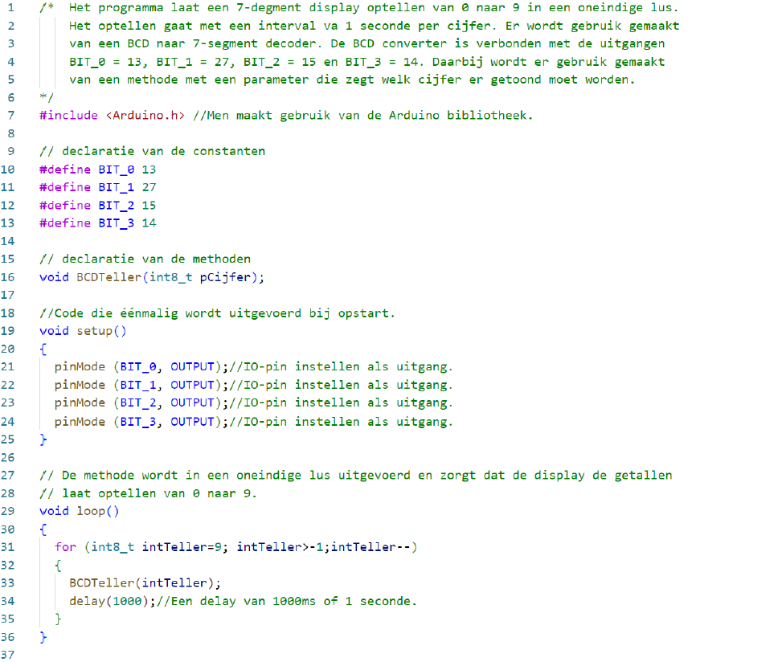

---
mathjax:
  presets: '\def\lr#1#2#3{\left#1#2\right#3}'
---

# CD4511BE

In vorige opdrachten werden de afzonderlijke LED's van het zevensegment display aangestuurd door afzonderlijke output pinnen van de microcontroller. Stel dat er meerdere dergelijke dsiplay's moeten worden aangestuurd (denk aan een klokje), dan zijn er al vlug pinnen tekort aan de microcontroller. Dit kan efficienter door gebruik te maken van een BCD naar 7-segment converter IC. 

Nu kan een 7-segment display aangestuurd worden met slechts 4 bits (= aantal output pinnen). Over die 4 bits wordt dan een BCD code verstuurd die aangeeft welk getal er moet worden gedisplayed. 

Een CD4511BE is een IC dat een BCD-waarde converteert naar de signalen voor een 7-segment display zoals weergegeven in de volgende figuur.

Bij de meeste IC’s is er een stip of een inkeping aangebracht zodat je vlug kan weten welke aansluiting pin 1 is. Plaats je de stip of inkeping (=zie rode cirkel in de figuur) naar boven, dan is de linkse bovenste aansluiting de aansluiting met nummer 1. De aansluitingen worden dan oplopend genummerd naar onderen. Bij de CD4511BE gaat dit tot pinnummer 8. De onderste rechtse pin is dan pin 9 en de pinnen worden naar boven toe oplopend verhoogd. Bij de CD4511BE is de bovenste rechter aansluiting pin 16.

Het intern schema van de CD4511BE is weergegeven in de volgende figuur.

Het voordeel om een CD4511BE te gebruiken is dat je maar 4 uitgangen van een microcontroller nodig hebt om een 7-segment display aan te sturen. Dit zijn 3 uitgangen minder dan in de voorgaande voorbeelden.

Nog een ander voordeel is dat het programma veel eenvoudiger wordt.

Een nadeel is dat de schakeling groter en duurder wordt (meer hardware).

Aan het intern schema van de volgende figuur is te zien is dat de BCD-ingangen A, B, C en D heten die aan de microcontroller verbonden moeten worden. De 7-segment uitgangen moeten aan het 7-segment display worden verbonden.

## Schema

Het schema dat wij gebruiken om de 7-segment display met de CD4511BE aan te sluiten aan onze microcontroller is weergegeven in de volgende figuur.

## Werking van de CD4511BE

In de waarheidstabel kan je duidelijk zien welke signalen je aan de ingangen moet leggen om een bepaald getal op de display te tonen. De waarheidstabel is weergegeven in de volgende tabel.

De CD4511BE heeft nog 3 externe ingangen namelijk, LT, BL en LE.

LT is de afkorting van Lamp Test. Als er 0V aan deze pin wordt aangeboden zullen alle segmenten van het display branden. Dit wordt gebruikt om te testen of alle segmenten werken. Dit is een actief lage ingang en daarom wordt er een invers symbool boven de benaming geplaatst. Wij leggen er 3,3V aan om deze functie te deactiveren.

BL is de afkorting van Blanking. Deze ingang is ook een actief lage ingang. Als er een 0V aan de ingang wordt aangelegd zullen alle segmenten gedoofd worden. Deze functie gaan we niet gebruiken en daarom leggen we er een spanning aan van 3,3V.

LE is de afkorting van Latch Enable en deze ingang dient om de schakeling van het IC te activeren of te deactiveren. Wij willen het IC gebruiken en daarom moet er een 0V signaal aan het IC worden aangesloten.

Voor meer informatie wordt hier verwezen naar de datasheet van het IC (zoek op internet naar PDF).

## Flowchart

## Programma

Opdracht: 7-segment display aansturen met een BCD naar 7 segment converter.
<ul style="color: white;">
<li>Bouw het schema en laadt de code in de ESP32 feather van Adafruit (pas de functiemethode aan).</li>
<li>Maak gebruik van de ESP32 feather van Adafruit, een 7-segment display (SC56-11EWA), een breadbord, voorschakelweerstanden en de nodige verbindingsdraden.</li>
<li>Teken eerst het schema in Visio</li>
<li>Bouw vervolgens de schakeling</li>
<li>Programmeer het programma en test het</li>
<li>Toon de werking aan de docent</li>
<li>Bespreek de werking van harware en software in het verslag</li>
</ul>

