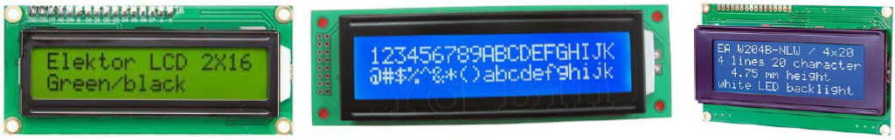

---
mathjax:
  presets: '\def\lr#1#2#3{\left#1#2\right#3}'
---

# Parallel LCD-display

We zullen een 2x16 LCD-karakter display gebruiken dat werkt met de HD44780 parallelle interface
met een voedingsspanning van 3,3V. Er zijn veel vergelijkbare LCD’s te vinden met dezelfde
hardware-configuratie en functionaliteit maar met een voedingsspanning van 5V, bij deze LCD’s komt
een logisch 1 van de IO’s overeen met 5V. Bij onze 1 x2 LCD is alles 3,3V en dus ook het logisch 1
niveau van het LCD.
Het schema en een de code is identiek als er gebruik gemaakt wordt van een 2x20 of 4x20 LCD.

