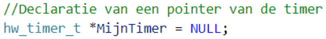
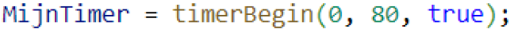
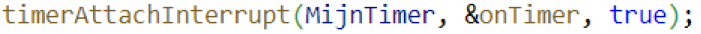
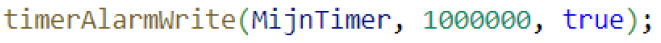
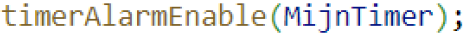
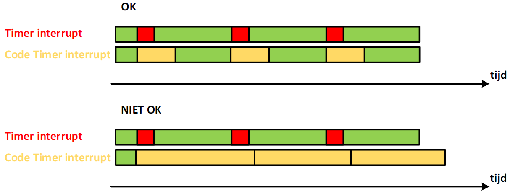
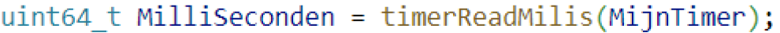
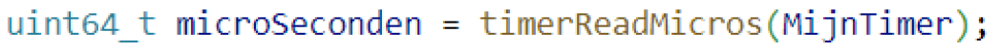
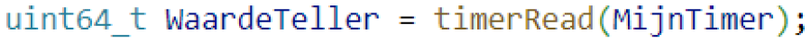

---
mathjax:
  presets: '\def\lr#1#2#3{\left#1#2\right#3}'
---

# Gebruik van hardware-timers en hun interrupts

Een nadeel om timers te gebruiken met het principe van millis is dat de tijd niet altijd heel nauwkeurig is. Er kan altijd een kleine fout aanwezig zijn omdat men niet constant vergelijkt. Andere code die de processor uitvoert neemt ook tijd in beslag. Omdat de timer van de controller maar om de 1ms verhoogd wordt kan men ook geen kleinere tijden dan 1ms registreren.

Door gebruik te maken van timer-interrupts kan men veel van de nadelen van het gebruik met millis oplossen. De ESP32 heeft twee hardware-timergroepen. Elke groep heeft twee hardware-timers voor algemeen gebruik, wat wil zeggen dat er in totaal 4 timers zijn. De tellers kunnen zowel op- als aftellen en kunnen automatisch worden herladen. 

::: tip
De frequentie van de teller werkt op 80MHz. Dit wil zeggen dat kleinste tijd van het verhogen van de tellers gelijk is aan 12,5 nanoseconden.
:::

$$ T_{min} = \frac{1} {80Mhz} = 12,5.10^{-9}sec = 12,5 nsec $$

::: details
12,5 nsec (nano seconde) is veel kleiner dan de tijd van millis() die 1 msec is. Natuurlijk is 12,5 nsec in veel gevallen te klein maar daarom kan er gebruik gemaakt worden van een 16 bit prescaler. Door gebruik te maken van de prescaler kan het interval dat de teller verhoogd wordt vergroot worden naar maximum 819,2 μsec (micro seconde).
:::

$$ T_{max} = T_{min}2^{16} = 12,5.10^{-9}sec.65536 = 819,2.10^{-6}sec = 819,2 µsec $$

## Declareren van de timer

Om een timer te gebruiken zal men een pointer declareren van het type hw_timer_t. Een pointer is het adres in het RAM geheugen waar alle instellingen van de timer staan. De naam van de pointer kan je zelf kiezen, bijvoorbeeld:

Om een pointer te declareren moet je het sterretje ‘*’ gebruiken en bij het declareren geven we er de waarde NULL aan, wat wil zeggen dat we de ruimte en de naam al bepalen maar nog geen instellingen.

## De timerBegin methode

Het volgende wat meestal gedaan wordt is de methode timerBegin uitvoeren. Deze methode heeft 3 parameters die moeten worden ingesteld. Een voorbeeld is hieronder weergegeven.

De eerste parameter is welke van de vier timers er worden gebruikt. Deze waarde kan (0, 1, 2 en 3)zijn. In het voorbeeld wordt timer 0 gebruikt.

De tweede parameter is de waarde van de prescaler. Deze kan tussen 0 en 65536 zijn. Meestal wordt deze ingesteld op 80. Dit wil zeggen dat de tijd tussen het verhogen van de teller 1μsec is. Dit is een waarde om gemakkelijk mee te rekenen en die nog heel klein is om een heel goeie nauwkeurigheid te bekomen.

De derde parameter is een boolean en bepaalt of de teller moet op- of aftellen. True is voor optellen en false is voor aftellen. In het voorbeeld is deze true wat wil zeggen dat deze zal optellen.

## De timerAttachInterrupt methode

Voordat de timer wordt gestart moet er een ISR aan de teller worden gekoppeld. ISR is de afkorting van Interrupts Service Routine. Hier wordt er verteld welke methode er moet worden uitgevoerd bij het genereren van de interrupt.

De eerste parameter is de naam van de Timer die je bij de declaratie hebt gegeven. In ons voorbeeld is dit MijnTimer.

De tweede parameter is de methode die moet uitgevoerd worden als de interrupt zich voordoet. Hier is dit de methode onTimer. Het &-teken moet je altijd voor de naam van de methode plaatsen.

De derde parameter moet je altijd op true instellen.

## De timerAlarmWrite methode

De timerAlarmWrite methode stelt de waarde van de teller in wanneer de interrupt gegenereerd moet worden.

Deze methode heeft 3 parameters. De eerste parameter is de naam van de Timer en is in ons voorbeeld MijnTimer.
De tweede parameter is de waarde van de teller waarbij de interrupt gegenereed moet worden. Als de teller de waarde 1000000 heeft zal de interrupt gegenereerd worden. Dit wil zeggen dat er een tijd verstreken zal zijn van 1 miljoen microseconden wat dus 1 seconde is. De microseconde is bepaald door de prescaler in te stellen op 80.
De derde parameter staat op true wat wil zeggen dat er autorelaod gebruikt wordt van de parameter. Dit wil zeggen dat de teller automatisch bij het genereren van de interrupt op nul gezet wordt en dat de interrupt periodiek gegenereerd zal worden.

## timerAlarmEnable methode

De laatste methode die wordt uitgevoerd is de timer

Deze methode zorgt ervoor dat aan de timer de interruptmethode wordt gekoppeld.

## Opmerking bij timerinterrupts

Bij geplande uitvoering van code moeten we voorzichtig zijn met de hoeveelheid code en hoelang het duurt om deze uit te voeren.
Als we bijvoorbeeld om de één milliseconde een taak moeten uitvoeren, moet die taak minder dan 1 ms seconde duren om deze uit te voeren, anders loopt de timing te hoog op en loopt het systeem niet synchroon. Zoals in volgende figuur.

>- Hoeveel code er is, zal bepalen hoe snel de processorklok moet zijn.
>- We moeten soms prioriteit geven aan de taken. Wordt een taak van 1 ms uitgevoerd voor een taak van 100 ms? (Omdat na 100 ms beide tegelijkertijd willen draaien).
>- Dit betekent ook dat pauze, wachttijd of vertragingen (d.w.z. timingcontrole door ‘polling’)niet kunnen worden gebruikt binnen geplande programmaontwerpen.

## Handige bijkomende methodes op timers

De voorgaande methodes worden het meest gebruikt. Er zijn nog een tal van andere methodes om te gebruiken bij Timers die in deze paragraaf worden uitgelegd.

### timerReadSeconds

Deze methode geeft de waarde van de meegegeven timer terug in seconden in een variabele van het type double.

### timerReadMilis

Deze methode geeft de waarde van de meegegeven timer terug in millieseconden in een 64 bit unsigned integer variabele.

### timerReadMicros

Deze methode geeft de waarde van de meegegeven timer terug in microseconden in een 64 bit unsigned integer variabele.

### timerRead

Deze methode geeft de waarde van de teller terug en plaatst deze in een 64 bit unsigned integer variabele.

