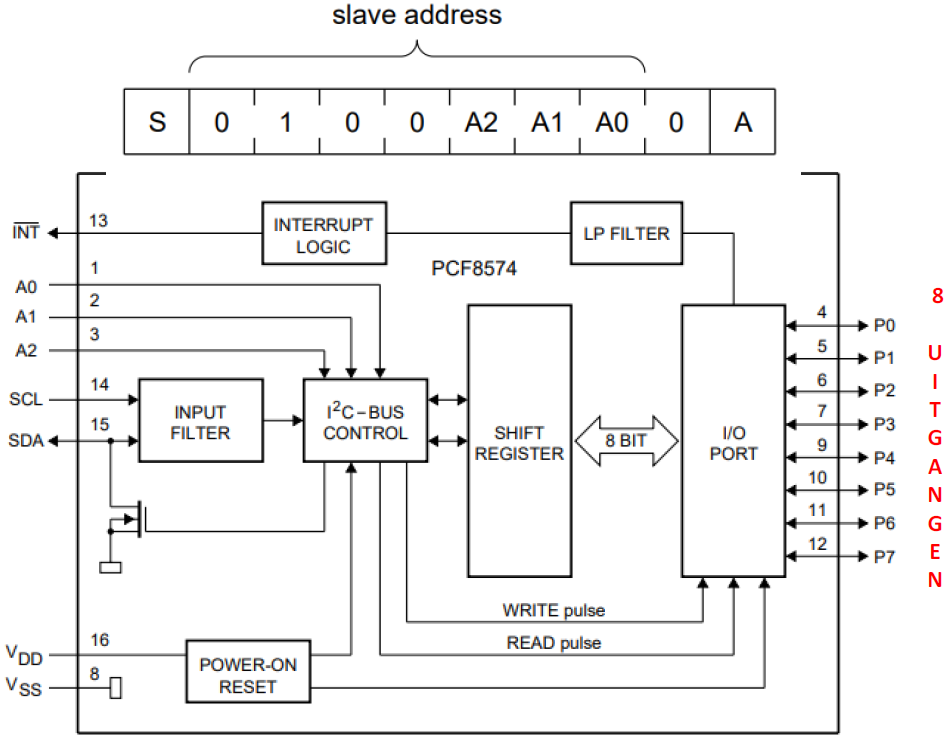
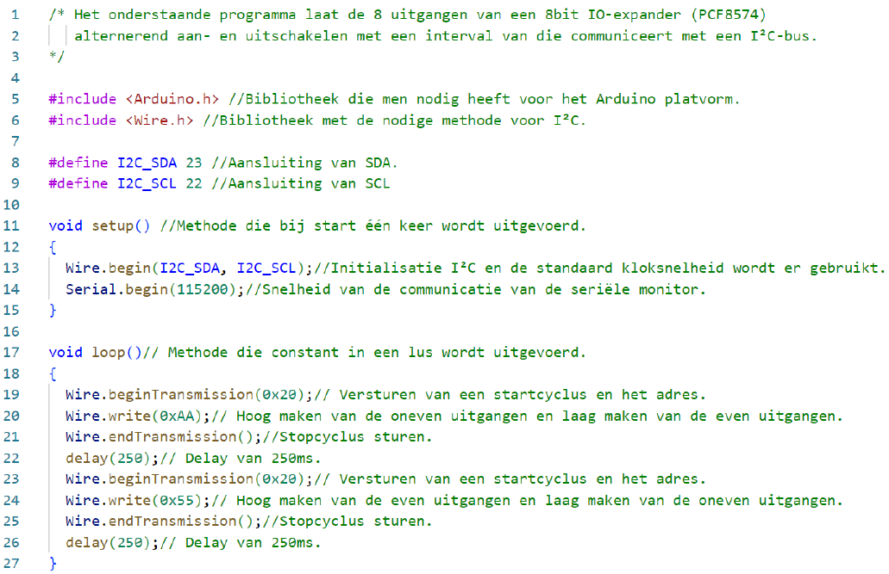
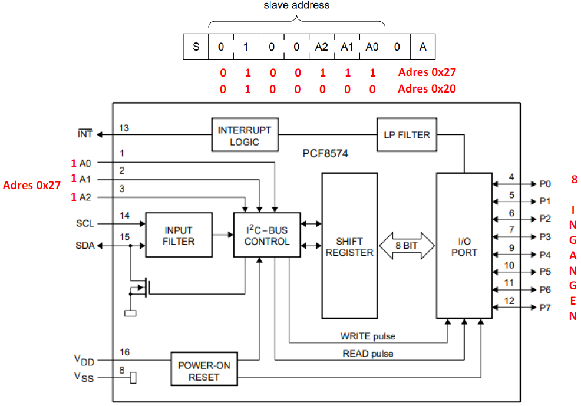
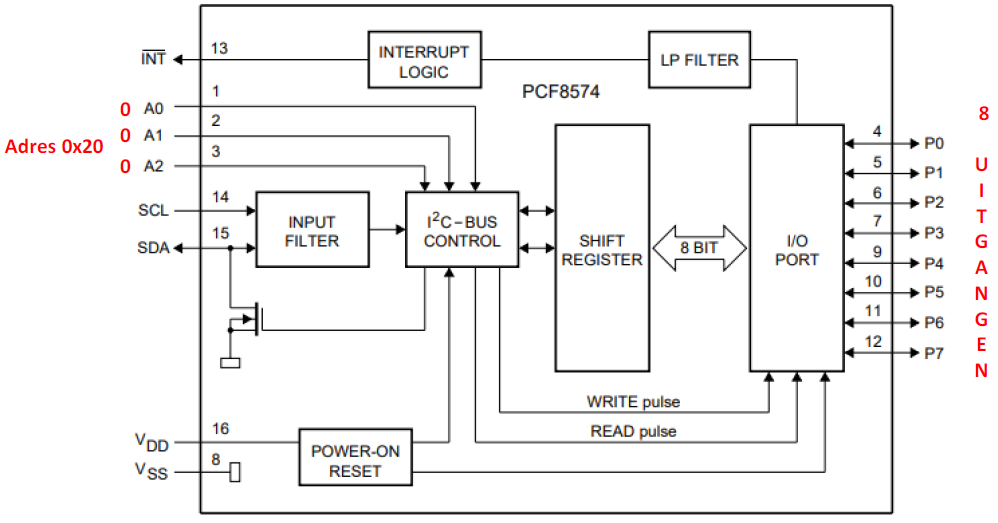
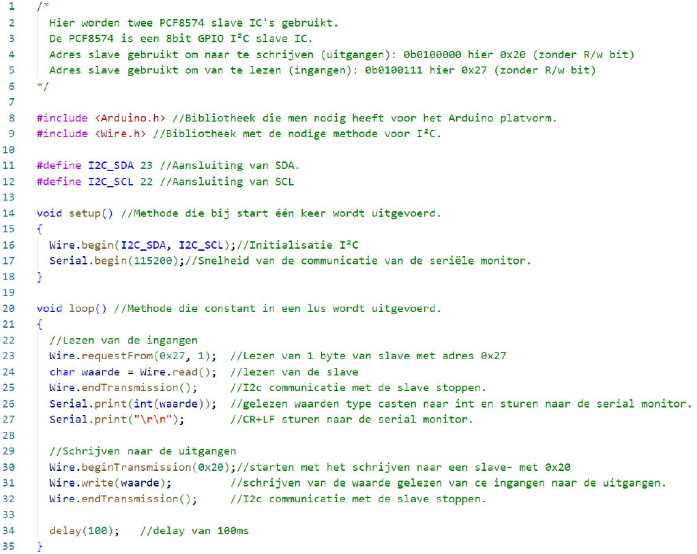

---
mathjax:
  presets: '\def\lr#1#2#3{\left#1#2\right#3}'
---

# ESP32 als I²C Master en een 8bit GPIO slave (PCF8574)

## Voorbeeld: schrijven naar een PCF8574

Een PCF8574 is een 8 bit IO-expander en wordt gebruikt om het aantal IO-pinnen uit te breiden met 8 bits. De interne werking van deze 8bit GPIO I²C slave is in volgende figuur weergegeven.

:::warning
Er bestaat ook een variant op dit IC nl. de PCF8574A en daar is het adres anders. Zoek dit desnoods op.
:::

## Voorbeeld: Schrijven naar en lezen van twee PCF8574 slaves

In het onderstaande voorbeeld worden twee IC’s van het type PCF8574 gebruikt. Het blokschema is weergegeven in de volgende figuur. Het bovenste IC met adres 0x27 wordt gebruikt voor 8 ingangen en daarvan zal gelezen moeten worden. Het onderste IC met adres 0x20 wordt gebruikt om 8 uitgang aan te verbinden en daarvan zal naar geschreven moeten worden.

